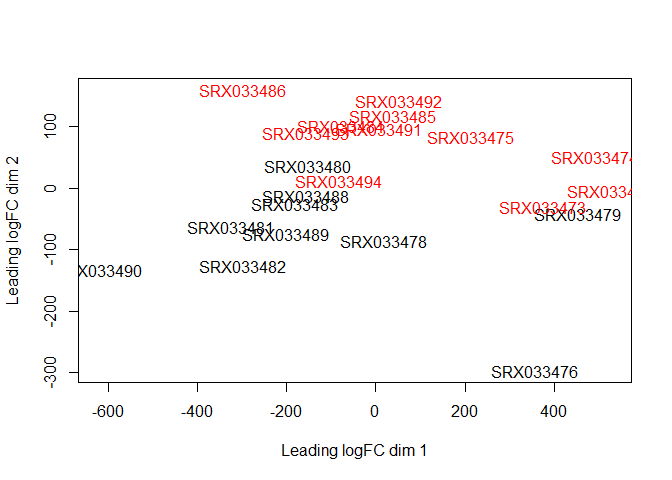
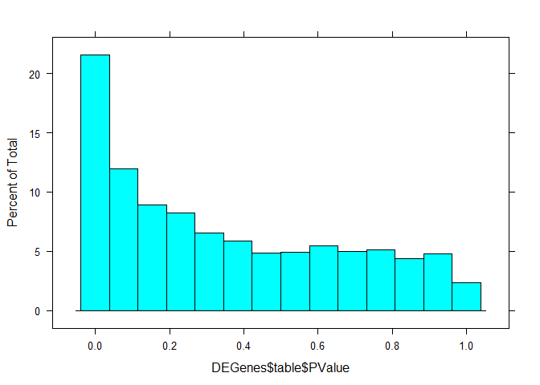
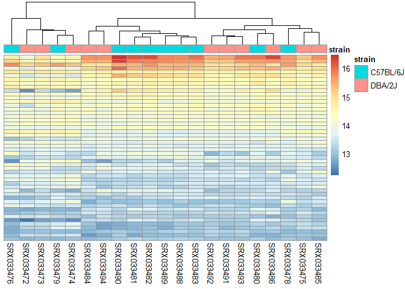
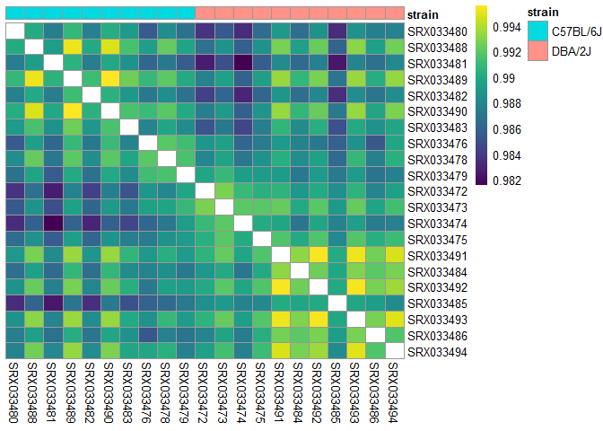
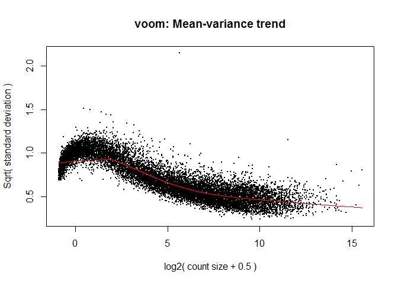

RNA seq analysis practice
================
Santina Lin
March 12, 2017

-   [Setup](#setup)
-   [Read data](#read-data)
-   [EdgeR](#edger)
    -   [DGEList data class](#dgelist-data-class)
    -   [Filtering](#filtering)
    -   [Normalization](#normalization)
    -   [Dispersion](#dispersion)
    -   [Find differentially expressed genes](#find-differentially-expressed-genes)
    -   [Gene ontology and pathway analysis](#gene-ontology-and-pathway-analysis)
-   [DESeq2](#deseq2)
    -   [Load data](#load-data)
    -   [Sanity check on data](#sanity-check-on-data)
    -   [Differential expression analysis](#differential-expression-analysis)
    -   [Exploring result](#exploring-result)
-   [Voom and limma](#voom-and-limma)

Setup
-----

Here we are using various packages to do RNAseq analysis.

``` r
#source("http://bioconductor.org/biocLite.R")
#biocLite("edgeR")
library(dplyr)
library(limma) # required by edgeR
library(edgeR)
#edgeRUsersGuide() # Read the reference manual up to p25. 
#biocLite("DESeq2")
library(DESeq2)
library(viridis) # for getting color-blind friendly colors
```

Read data
---------

The data comes from [this publication](https://www.ncbi.nlm.nih.gov/pubmed?term=21455293). It's RNAseq from mice.

``` r
# Both have headers and rownames. Without row.names the column would just be called "gene"
data <- read.table("https://raw.githubusercontent.com/STAT540-UBC/STAT540-UBC.github.io/master/examples/bottomly/data/bottomly_count_table.tsv", header=TRUE, row.names=1)
des <- read.table("https://raw.githubusercontent.com/STAT540-UBC/STAT540-UBC.github.io/master/examples/bottomly/data/bottomly_phenodata.tsv", header=TRUE, row.names=1) 
```

EdgeR
-----

Much of the analysis here is based on the manual. Please read them for more details.

### DGEList data class

First inspect the data

``` r
table(des$strain)
```

    ## 
    ## C57BL/6J   DBA/2J 
    ##       10       11

``` r
head(data)
```

    ##                    SRX033480 SRX033488 SRX033481 SRX033489 SRX033482
    ## ENSMUSG00000000001       369       744       287       769       348
    ## ENSMUSG00000000003         0         0         0         0         0
    ## ENSMUSG00000000028         0         1         0         1         1
    ## ENSMUSG00000000031         0         0         0         0         0
    ## ENSMUSG00000000037         0         1         1         5         0
    ## ENSMUSG00000000049         0         1         0         1         0
    ##                    SRX033490 SRX033483 SRX033476 SRX033478 SRX033479
    ## ENSMUSG00000000001       803       433       469       585       321
    ## ENSMUSG00000000003         0         0         0         0         0
    ## ENSMUSG00000000028         1         0         7         6         1
    ## ENSMUSG00000000031         0         0         0         0         0
    ## ENSMUSG00000000037         4         0         0         0         0
    ## ENSMUSG00000000049         0         0         0         0         0
    ##                    SRX033472 SRX033473 SRX033474 SRX033475 SRX033491
    ## ENSMUSG00000000001       301       461       309       374       781
    ## ENSMUSG00000000003         0         0         0         0         0
    ## ENSMUSG00000000028         1         1         1         1         1
    ## ENSMUSG00000000031         0         0         0         0         0
    ## ENSMUSG00000000037         4         1         1         0         1
    ## ENSMUSG00000000049         0         0         0         0         0
    ##                    SRX033484 SRX033492 SRX033485 SRX033493 SRX033486
    ## ENSMUSG00000000001       555       820       294       758       419
    ## ENSMUSG00000000003         0         0         0         0         0
    ## ENSMUSG00000000028         2         1         1         4         1
    ## ENSMUSG00000000031         0         0         0         0         0
    ## ENSMUSG00000000037         2         1         1         1         1
    ## ENSMUSG00000000049         0         0         0         0         0
    ##                    SRX033494
    ## ENSMUSG00000000001       857
    ## ENSMUSG00000000003         0
    ## ENSMUSG00000000028         5
    ## ENSMUSG00000000031         0
    ## ENSMUSG00000000037         2
    ## ENSMUSG00000000049         0

We can see that the count data has many zeros. To use edgeR, we need to store in a simple list-based object called DGEList, because many functions after that takes this kind of object. We can add a grouping factor at the same time.

``` r
(group <- factor(c(rep("1",10),rep("2",11)))) 
```

    ##  [1] 1 1 1 1 1 1 1 1 1 1 2 2 2 2 2 2 2 2 2 2 2
    ## Levels: 1 2

``` r
dge.obj <- DGEList(counts=data, group=group)
names(dge.obj) # a list consists of two things 
```

    ## [1] "counts"  "samples"

The object "samples" summarizes the information in the count data.

``` r
head(dge.obj$samples)
```

    ##           group lib.size norm.factors
    ## SRX033480     1  3040296            1
    ## SRX033488     1  6303665            1
    ## SRX033481     1  2717092            1
    ## SRX033489     1  6545795            1
    ## SRX033482     1  3016179            1
    ## SRX033490     1  7097379            1

What's the smallest lib.size?

``` r
(min_lib_size_million <- min(dge.obj$samples$lib.size) / 1000000)
```

    ## [1] 2.717092

The smallest lib size is about 2.7 millions.

### Filtering

"In a biological point of view, a gene must be expressed at some minimal level before it's likely to be translated." We will exclude genes with very low count so that they don't interfere with our later statistical analysis.

According to the manual, we would drop off the genes that aren't present in at least one sample for any of the conditions and filter with CPM (count-per-million) instead of the rare counts so that we're taking the library sizes into account.

``` r
dge.obj.cpm <- cpm(dge.obj) # count per million. Not sure if I need to do log=TRUE to log transform (base 2) here. 
# sanity check using unsupervised clustering
plotMDS(dge.obj.cpm,  col=c(rep("black",10), rep("red",11)) ) 
```



``` r
# Filtering 

# Manual said "a gene is required to have a count of 5-10" in a library to be considered expressed in that library".
threshold <- 5/min_lib_size_million # cpm of 2 is equivalent to ~5-6 count in the smallest library
keep <- rowSums(dge.obj.cpm > threshold) 
keep <- keep >=10  # filter for gene expressed in at least 10 samples for one condition
dge.obj.filtered <- dge.obj[keep, , keep.lib.sizes=FALSE] # keep.lib.sizes recalculates the library size. 
head(dge.obj.filtered$samples)
```

    ##           group lib.size norm.factors
    ## SRX033480     1  3034127            1
    ## SRX033488     1  6290532            1
    ## SRX033481     1  2711332            1
    ## SRX033489     1  6532326            1
    ## SRX033482     1  3009697            1
    ## SRX033490     1  7081581            1

We can see that the lib.size are smaller compare to those in `dge.obj` after we dropped out some genes.

Let's see how many genes we have left.

``` r
dim(dge.obj); dim(dge.obj.filtered);
```

    ## [1] 36536    21

    ## [1] 8655   21

We have 8655 genes left.

### Normalization

edgeR will automatically adjust differential expression analysis for different sequencing depth as represented by the library sizes. We don't need to normalize for sequencing depth.

RNA composition: some small number of genes are highly expression in one sample, but not in another. These genes can consume a big proportion of the library size and making other genes to look under-sampled or lowly expressed. So we need to adjust for this using `calcNormFactors`. This function minimizes the log fold change (lfc) between samples for most genes using a scaling factors computed using TMM (trimmed mean of M-values). I still need to Google what that is. The manual says you use TMM if you think most of your genes are not differentially expressed between any pair of the samples.

``` r
dge.obj.filtered.norm <- calcNormFactors(dge.obj.filtered)
head(dge.obj.filtered.norm$sample)
```

    ##           group lib.size norm.factors
    ## SRX033480     1  3034127    0.9799779
    ## SRX033488     1  6290532    0.9861372
    ## SRX033481     1  2711332    0.9881436
    ## SRX033489     1  6532326    1.0024760
    ## SRX033482     1  3009697    0.9762673
    ## SRX033490     1  7081581    0.9902589

Now the norm factors are no longer 1 like in `dge.obj.filtered`. norm.factors &lt; 1 tell us that there are a small number of genes that make up a substantial proportion of counts. In this case, the library size will be scaled down so to scale the counts of the other genes upward.

### Dispersion

The manual presented two options: using the classical linera model or use generalized linear models (GLM). We'll use the latter here.

``` r
# make a design matrix
design <- model.matrix(~group)

# Estimate trend-wise (all tag) dispersion and then tag-wise (one tag) dispersion in one go. 
dge.obj.filtered.norm.disp <- estimateDisp(dge.obj.filtered.norm, design)
plotBCV(dge.obj.filtered.norm.disp)
```


``` r
names(dge.obj.filtered.norm.disp)
```

    ##  [1] "counts"             "samples"            "design"            
    ##  [4] "common.dispersion"  "trended.dispersion" "tagwise.dispersion"
    ##  [7] "AveLogCPM"          "trend.method"       "prior.df"          
    ## [10] "prior.n"            "span"

### Find differentially expressed genes

Fit the negative binomial GLM for each tag.

``` r
fit <- glmFit(dge.obj.filtered.norm.disp, design)
names(fit)
```

    ##  [1] "coefficients"          "fitted.values"        
    ##  [3] "deviance"              "method"               
    ##  [5] "counts"                "unshrunk.coefficients"
    ##  [7] "df.residual"           "design"               
    ##  [9] "offset"                "dispersion"           
    ## [11] "prior.count"           "samples"              
    ## [13] "prior.df"              "AveLogCPM"

``` r
lrt <- glmLRT(fit,coef="group2")
DEGenes <- topTags(lrt, n=Inf) # get the top expressed genes
names(DEGenes)
```

    ## [1] "table"         "adjust.method" "comparison"    "test"

``` r
DEGenes$test; DEGenes$comparison; DEGenes$adjust.method
```

    ## [1] "glm"

    ## [1] "group2"

    ## [1] "BH"

``` r
head(DEGenes$table)
```

    ##                        logFC   logCPM       LR       PValue          FDR
    ## ENSMUSG00000020912 -5.216276 3.158415 411.3119 1.899194e-91 1.643752e-87
    ## ENSMUSG00000015484 -1.997495 4.314050 342.4881 1.832370e-76 7.929581e-73
    ## ENSMUSG00000050141 -5.392143 2.319460 315.9460 1.106564e-70 3.192437e-67
    ## ENSMUSG00000035775 -4.572107 2.674424 303.3321 6.192166e-68 1.339830e-64
    ## ENSMUSG00000030532  1.519004 5.569878 295.2067 3.648420e-66 6.315415e-63
    ## ENSMUSG00000024248 -3.180181 3.473316 293.2028 9.970094e-66 1.438186e-62

``` r
lattice::histogram(DEGenes$table$PValue) 
```



We can also use `glmQLFit()` and `glmQLFTest()` instead if our sample size is small.

Up to this point, we can also filter by the logFC if we're only interested in up-regulation, down-regulation, or certain absolute log fold change.

The p values for the first few are crazy small. Let's see how many have p value &lt; 0.001

``` r
sum(DEGenes$table$PValue <= 0.001 )
```

    ## [1] 661

### Gene ontology and pathway analysis

First let's look at only the top genes that have p value &lt; 0.001

``` r
top <- DEGenes[DEGenes$table$PValue <= 0.001 , ]
edgeR.genes.names <- rownames(top$table)
```

``` r
# make sure you have installed "GO.db" package: biocLite("GO.db")
# Also need `biocLite("org.Mm.eg.db")` for data on mice
keg <- kegga(edgeR.genes.names, species="Mm")  # manual has a mistake, need to use rownames
gene.enrich <- topKEGG(keg)
head(gene.enrich)
```

    ##                                                   Pathway N DE P.DE
    ## path:mmu00472       D-Arginine and D-ornithine metabolism 1  0    1
    ## path:mmu00300                         Lysine biosynthesis 2  0    1
    ## path:mmu00780                           Biotin metabolism 3  0    1
    ## path:mmu00471      D-Glutamine and D-glutamate metabolism 3  0    1
    ## path:mmu00785                      Lipoic acid metabolism 3  0    1
    ## path:mmu00290 Valine, leucine and isoleucine biosynthesis 4  0    1

``` r
nrow(gene.enrich)
```

    ## [1] 20

There are 20 different functions.

DESeq2
------

User manual can be found [here](https://www.bioconductor.org/packages/release/bioc/vignettes/DESeq2/inst/doc/DESeq2.pdf)

DESeq2's workflow is a lot simplier. A lot of step (transformation, normalization) will be done internally. We just need to give the raw count data.

Also, according to Paul, the underlying analyses of edgeR and DESeq2 are becoming closer and closer to each other.

### Load data

``` r
dd <- DESeq2::DESeqDataSetFromMatrix(countData = data, colData = des, design = ~strain)
dds <- DESeq2::DESeq(dd)
```

    ## estimating size factors

    ## estimating dispersions

    ## gene-wise dispersion estimates

    ## mean-dispersion relationship

    ## final dispersion estimates

    ## fitting model and testing

    ## -- replacing outliers and refitting for 11 genes
    ## -- DESeq argument 'minReplicatesForReplace' = 7 
    ## -- original counts are preserved in counts(dds)

    ## estimating dispersions

    ## fitting model and testing

### Sanity check on data

Let's do some quality assessment with the functions from DESeq2 do to sample clustering.

**Heatmap of the count matrix**

``` r
library("pheatmap")
```

    ## Warning: package 'pheatmap' was built under R version 3.3.2

``` r
select <- order(rowMeans(counts(dds,normalized=TRUE)), 
                decreasing=TRUE)[1:50] # order the count 

nt <- DESeq2::normTransform(dds) # defaults to log2(x+1)

log2.norm.counts <- assay(nt)[select,]
labels <- dplyr::select(des, strain)
pheatmap(log2.norm.counts, cluster_rows=FALSE, annotation_col = labels, annotation_legend = TRUE, show_rownames=FALSE)
```



\*\* Heatmap of sample-to-sample distance \*\* Using all the genes

``` r
sample_dist <- cor(assay(nt)) 
diag(sample_dist) <- NA # Getting rid of 1 to see the correlation better
pheatmap(sample_dist, 
         color = viridis(256, option = "D"),
         cluster_rows=FALSE, 
         cluster_cols = FALSE, 
         annotation = labels, 
         annotation_legend = TRUE)
```



\*\* PCA \*\*

``` r
rld <- DESeq2::rlog(dds, blind=FALSE) # take the log of counts
DESeq2::plotPCA(rld, intgroup = "strain")
```


### Differential expression analysis

``` r
result <- DESeq2::results(dds) 
head(result) # note that it's not like toptag that it's ordered
```

    ## log2 fold change (MAP): strain DBA/2J vs C57BL/6J 
    ## Wald test p-value: strain DBA/2J vs C57BL/6J 
    ## DataFrame with 6 rows and 6 columns
    ##                        baseMean log2FoldChange      lfcSE       stat
    ##                       <numeric>      <numeric>  <numeric>  <numeric>
    ## ENSMUSG00000000001 489.17565187    -0.10562888 0.09385420 -1.1254571
    ## ENSMUSG00000000003   0.00000000             NA         NA         NA
    ## ENSMUSG00000000028   1.56775318    -0.05694074 0.17681464 -0.3220363
    ## ENSMUSG00000000031   0.00000000             NA         NA         NA
    ## ENSMUSG00000000037   1.10104404     0.07638290 0.16262582  0.4696850
    ## ENSMUSG00000000049   0.06870616    -0.01283400 0.05193818 -0.2471013
    ##                       pvalue      padj
    ##                    <numeric> <numeric>
    ## ENSMUSG00000000001 0.2603954 0.5531512
    ## ENSMUSG00000000003        NA        NA
    ## ENSMUSG00000000028 0.7474252 0.8959461
    ## ENSMUSG00000000031        NA        NA
    ## ENSMUSG00000000037 0.6385801 0.8414511
    ## ENSMUSG00000000049 0.8048298        NA

``` r
lattice::histogram(result$pvalue)
```


How many genes have pvalue &lt; 0.001

``` r
result <- na.omit(result) # get rid of the rows with NA 
top_deseq2 <- result[result$pvalue < 0.001, ]
```

Comparing DESeq2 and edgeR

``` r
deseq2.genes.names <- rownames(top_deseq2)
length(edgeR.genes.names); length(deseq2.genes.names); 
```

    ## [1] 661

    ## [1] 833

``` r
length(intersect(edgeR.genes.names, deseq2.genes.names))
```

    ## [1] 640

We get more genes by doing DESEq2. There are many overlapping genes.

### Exploring result

``` r
DESeq2::plotMA(result, main="DESeq2", ylim=c(-3,3))
```


In red are those with adjusted p value less than 0.1.

Voom and limma
--------------

Very similar to limma, with lmFit, eBayes, and topTable.

``` r
norm.factor <- calcNormFactors(data)
design <- model.matrix(~group)
dat.voomed <- voom(data,design,plot=TRUE,lib.size=colSums(data)*norm.factor)
```



``` r
fit <- lmFit(dat.voomed, design)
fit <- eBayes(fit)
topTable(fit, coef="group2", n=5)
```

    ##                        logFC    AveExpr         t      P.Value
    ## ENSMUSG00000015484 -1.994877  3.9634712 -20.49015 6.099197e-18
    ## ENSMUSG00000027855  5.342830 -0.3131727  22.23386 7.634327e-19
    ## ENSMUSG00000030532  1.538774  5.3545041  19.71027 1.626166e-17
    ## ENSMUSG00000023236  1.419650  6.8878509  19.36190 2.548026e-17
    ## ENSMUSG00000054354 -5.824033 -0.2156264 -20.38549 6.943714e-18
    ##                       adj.P.Val        B
    ## ENSMUSG00000015484 8.456517e-14 30.79013
    ## ENSMUSG00000027855 2.789278e-14 30.23763
    ## ENSMUSG00000030532 1.485340e-13 30.03998
    ## ENSMUSG00000023236 1.551578e-13 29.64388
    ## ENSMUSG00000054354 8.456517e-14 28.84070
