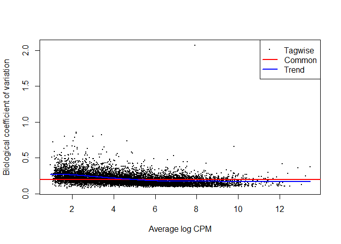

RNA seq analysis practice
================
Santina Lin
March 12, 2017

-   [Setup](#setup)
-   [Read data](#read-data)
-   [EdgeR](#edger)
    -   [DGEList data class](#dgelist-data-class)
    -   [Filtering](#filtering)
    -   [Normalization](#normalization)
    -   [Dispersion](#dispersion)
    -   [Find differentially expressed genes](#find-differentially-expressed-genes)
    -   [Gene ontology and pathway analysis](#gene-ontology-and-pathway-analysis)

Setup
-----

Here we are using various packages to do RNAseq analysis.

``` r
#source("http://bioconductor.org/biocLite.R")
#biocLite("edgeR")
library(ggplot2)
library(limma) # required by edgeR
library(edgeR)
#edgeRUsersGuide() # Read the reference manual up to p25. 
library(DESeq)
```

Read data
---------

The data comes from [this publication](https://www.ncbi.nlm.nih.gov/pubmed?term=21455293). It's RNAseq from mice.

``` r
# Both have headers and rownames. Without row.names the column would just be called "gene"
data <- read.table("https://raw.githubusercontent.com/STAT540-UBC/STAT540-UBC.github.io/master/examples/bottomly/data/bottomly_count_table.tsv", header=TRUE, row.names=1)
des <- read.table("https://raw.githubusercontent.com/STAT540-UBC/STAT540-UBC.github.io/master/examples/bottomly/data/bottomly_phenodata.tsv", header=TRUE, row.names=1) 
```

EdgeR
-----

Much of the analysis here is based on the manual. Please read them for more details.

### DGEList data class

First inspect the data

``` r
table(des$strain)
```

    ## 
    ## C57BL/6J   DBA/2J 
    ##       10       11

``` r
head(data)
```

    ##                    SRX033480 SRX033488 SRX033481 SRX033489 SRX033482
    ## ENSMUSG00000000001       369       744       287       769       348
    ## ENSMUSG00000000003         0         0         0         0         0
    ## ENSMUSG00000000028         0         1         0         1         1
    ## ENSMUSG00000000031         0         0         0         0         0
    ## ENSMUSG00000000037         0         1         1         5         0
    ## ENSMUSG00000000049         0         1         0         1         0
    ##                    SRX033490 SRX033483 SRX033476 SRX033478 SRX033479
    ## ENSMUSG00000000001       803       433       469       585       321
    ## ENSMUSG00000000003         0         0         0         0         0
    ## ENSMUSG00000000028         1         0         7         6         1
    ## ENSMUSG00000000031         0         0         0         0         0
    ## ENSMUSG00000000037         4         0         0         0         0
    ## ENSMUSG00000000049         0         0         0         0         0
    ##                    SRX033472 SRX033473 SRX033474 SRX033475 SRX033491
    ## ENSMUSG00000000001       301       461       309       374       781
    ## ENSMUSG00000000003         0         0         0         0         0
    ## ENSMUSG00000000028         1         1         1         1         1
    ## ENSMUSG00000000031         0         0         0         0         0
    ## ENSMUSG00000000037         4         1         1         0         1
    ## ENSMUSG00000000049         0         0         0         0         0
    ##                    SRX033484 SRX033492 SRX033485 SRX033493 SRX033486
    ## ENSMUSG00000000001       555       820       294       758       419
    ## ENSMUSG00000000003         0         0         0         0         0
    ## ENSMUSG00000000028         2         1         1         4         1
    ## ENSMUSG00000000031         0         0         0         0         0
    ## ENSMUSG00000000037         2         1         1         1         1
    ## ENSMUSG00000000049         0         0         0         0         0
    ##                    SRX033494
    ## ENSMUSG00000000001       857
    ## ENSMUSG00000000003         0
    ## ENSMUSG00000000028         5
    ## ENSMUSG00000000031         0
    ## ENSMUSG00000000037         2
    ## ENSMUSG00000000049         0

We can see that the count data has many zeros. To use edgeR, we need to store in a simple list-based object called DGEList, because many functions after that takes this kind of object. We can add a grouping factor at the same time.

``` r
(group <- factor(c(rep("1",10),rep("2",11)))) 
```

    ##  [1] 1 1 1 1 1 1 1 1 1 1 2 2 2 2 2 2 2 2 2 2 2
    ## Levels: 1 2

``` r
dge.obj <- DGEList(counts=data, group=group)
names(dge.obj) # a list consists of two things 
```

    ## [1] "counts"  "samples"

The object "samples" summarizes the information in the count data.

``` r
head(dge.obj$samples)
```

    ##           group lib.size norm.factors
    ## SRX033480     1  3040296            1
    ## SRX033488     1  6303665            1
    ## SRX033481     1  2717092            1
    ## SRX033489     1  6545795            1
    ## SRX033482     1  3016179            1
    ## SRX033490     1  7097379            1

What's the smallest lib.size?

``` r
min(dge.obj$samples$lib.size)
```

    ## [1] 2717092

The smallest lib size is about 2.7 millions.

### Filtering

"In a biological point of view, a gene must be expressed at some minimal level before it's likely to be translated." We will exclude genes with very low count so that they don't interfere with our later statistical analysis.

According to the manual, we would drop off the genes that aren't present in at least one sample for any of the conditions and filter with CPM (count-per-million) instead of the rare counts so that we're taking the library sizes into account.

``` r
dge.obj.cpm <- cpm(dge.obj, log=TRUE) # count per million. Not sure if I need to do log=TRUE to log transform (base 2) here. 
# sanity check using unsupervised clustering
plotMDS(dge.obj.cpm,  col=c(rep("black",10), rep("red",11)) ) 
```


``` r
# Filtering 
threshold <- log2(5*2.7)
keep <- rowSums(dge.obj.cpm > threshold) # filter for log cpm > 3.3
keep <- keep >=10  # filter for gene expressed in at least 10 samples for one condition
dge.obj.filtered <- dge.obj[keep, , keep.lib.sizes=FALSE] # keep.lib.sizes recalculates the library size. 
head(dge.obj.filtered$samples)
```

    ##           group lib.size norm.factors
    ## SRX033480     1  2978971            1
    ## SRX033488     1  6177462            1
    ## SRX033481     1  2661232            1
    ## SRX033489     1  6411180            1
    ## SRX033482     1  2955195            1
    ## SRX033490     1  6949190            1

We can see that the lib.size are smaller compare to those in `dge.obj` after we dropped out some genes.

Manual said "a gene is required to have a count of 5-10" in a library to be considered expressed in that library, so that's why I filter it by log2(5\*2.7); our smallest library size is 2.7 million.

Let's see how many genes we have left.

``` r
dim(dge.obj); dim(dge.obj.filtered);
```

    ## [1] 36536    21

    ## [1] 5598   21

We have 5598 genes left.

### Normalization

edgeR will automatically adjust differential expression analysis for different sequencing depth as represented by the library sizes. We don't need to normalize for sequencing depth.

RNA composition: some small number of genes are highly expression in one sample, but not in another. These genes can consume a big proportion of the library size and making other genes to look under-sampled or lowly expressed. So we need to adjust for this using `calcNormFactors`. This function minimizes the log fold change (lfc) between samples for most genes using a scaling factors computed using TMM (trimmed mean of M-values). I still need to Google what that is. The manual says you use TMM if you think most of your genes are not differentially expressed between any pair of the samples.

``` r
dge.obj.filtered.norm <- calcNormFactors(dge.obj.filtered)
head(dge.obj.filtered.norm$sample)
```

    ##           group lib.size norm.factors
    ## SRX033480     1  2978971    0.9875932
    ## SRX033488     1  6177462    0.9939317
    ## SRX033481     1  2661232    0.9909975
    ## SRX033489     1  6411180    1.0067678
    ## SRX033482     1  2955195    0.9828178
    ## SRX033490     1  6949190    0.9901124

Now the norm factors are no longer 1 like in `dge.obj.filtered`. norm.factors &lt; 1 tell us that there are a small number of genes that make up a substantial proportion of counts. In this case, the library size will be scaled down so to scale the counts of the other genes upward.

### Dispersion

The manual presented two options: using the classical linera model or use generalized linear models (GLM). We'll use the latter here.

``` r
# make a design matrix
design <- model.matrix(~group)

# Estimate trend-wise (all tag) dispersion and then tag-wise (one tag) dispersion in one go. 
dge.obj.filtered.norm.disp <- estimateDisp(dge.obj.filtered.norm, design)
plotBCV(dge.obj.filtered.norm.disp)
```



``` r
names(dge.obj.filtered.norm.disp)
```

    ##  [1] "counts"             "samples"            "design"            
    ##  [4] "common.dispersion"  "trended.dispersion" "tagwise.dispersion"
    ##  [7] "AveLogCPM"          "trend.method"       "prior.df"          
    ## [10] "prior.n"            "span"

### Find differentially expressed genes

Fit the negative binomial GLM for each tag.

``` r
fit <- glmFit(dge.obj.filtered.norm.disp, design)
names(fit)
```

    ##  [1] "coefficients"          "fitted.values"        
    ##  [3] "deviance"              "method"               
    ##  [5] "counts"                "unshrunk.coefficients"
    ##  [7] "df.residual"           "design"               
    ##  [9] "offset"                "dispersion"           
    ## [11] "prior.count"           "samples"              
    ## [13] "prior.df"              "AveLogCPM"

``` r
lrt <- glmLRT(fit,coef="group2")
DEGenes <- topTags(lrt, n=Inf) # get the top expressed genes
names(DEGenes)
```

    ## [1] "table"         "adjust.method" "comparison"    "test"

``` r
DEGenes$test; DEGenes$comparison; DEGenes$adjust.method
```

    ## [1] "glm"

    ## [1] "group2"

    ## [1] "BH"

``` r
head(DEGenes$table)
```

    ##                        logFC   logCPM       LR       PValue          FDR
    ## ENSMUSG00000015484 -1.998512 4.340754 369.8932 1.974437e-82 1.105290e-78
    ## ENSMUSG00000030532  1.520040 5.597944 328.2738 2.284383e-73 6.393989e-70
    ## ENSMUSG00000024248 -3.180704 3.500834 305.0016 2.679972e-68 5.000827e-65
    ## ENSMUSG00000023236  1.400762 7.092576 282.3746 2.281013e-63 3.192278e-60
    ## ENSMUSG00000072572 -2.036295 3.739185 216.7730 4.573907e-49 5.120946e-46
    ## ENSMUSG00000028393  1.775881 6.135877 206.3210 8.720740e-47 8.136451e-44

``` r
histogram(DEGenes$table$PValue) 
```


We can also use `glmQLFit()` and `glmQLFTest()` instead if our sample size is small.

Up to this point, we can also filter by the logFC if we're only interested in up-regulation, down-regulation, or certain absolute log fold change.

The p values for the first few are crazy small. Let's see how many have p value &lt; 0.001

``` r
sum(DEGenes$table$PValue <= 0.001 )
```

    ## [1] 419

### Gene ontology and pathway analysis

First let's look at only the top genes that have p value &lt; 0.001

``` r
top <- DEGenes[DEGenes$table$PValue <= 0.001 , ]
```

``` r
# make sure you have installed "GO.db" package: biocLite("GO.db")
# Also need `biocLite("org.Mm.eg.db")` for data on mice
keg <- kegga(rownames(top$table), species="Mm")  # manual has a mistake, need to use rownames
gene.enrich <- topKEGG(keg)
head(gene.enrich)
```

    ##                                                   Pathway N DE P.DE
    ## path:mmu00472       D-Arginine and D-ornithine metabolism 1  0    1
    ## path:mmu00300                         Lysine biosynthesis 2  0    1
    ## path:mmu00780                           Biotin metabolism 3  0    1
    ## path:mmu00471      D-Glutamine and D-glutamate metabolism 3  0    1
    ## path:mmu00785                      Lipoic acid metabolism 3  0    1
    ## path:mmu00290 Valine, leucine and isoleucine biosynthesis 4  0    1

``` r
nrow(gene.enrich)
```

    ## [1] 20

There are 20 different functions.
