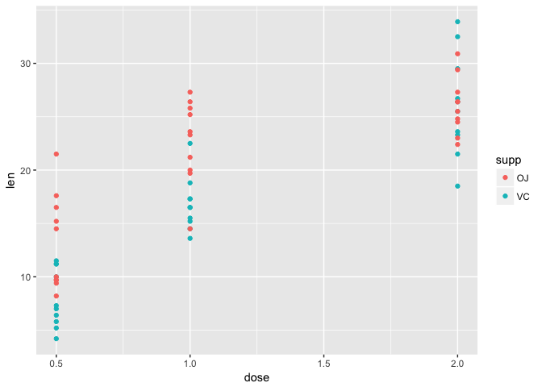
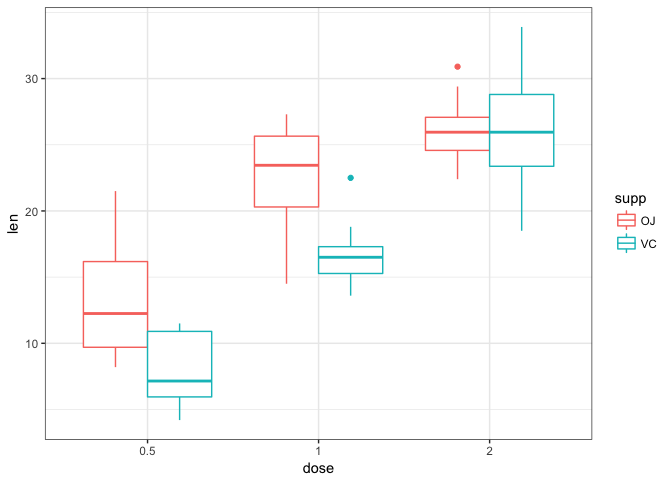

Practice assignment reference
================
Santina Lin
January 24, 2017

This is an answer key that was hastly written up prior to grading the assignment. By no mean it's perfect. Please look at the raw Rmd to get an idea of the use of inline R code, R chunk options, etc.

Usually at the beginning of a R markdown, you load some R packages that you need in an R chunk, and use R chunk options to hide any messages/output from loading these packages.

``` r
library(dplyr)
library(ggplot2)
```

Question 1 - README
===================

My README is at the root of this repository. There you can see a brief description about myself.

Question 2 - Titanic dataset
============================

In this question, we are exploring the `Titanic` dataset in base R to get some hand-on experience on how to do some basic data inspection with R.

Question 2.1 - People
---------------------

First I will convert the table `Titanic` into a daat.frame so that I can easily inspect the data with some commonly used functions in R.

``` r
titanic_data <- data.frame(Titanic)
str(titanic_data)
```

    ## 'data.frame':    32 obs. of  5 variables:
    ##  $ Class   : Factor w/ 4 levels "1st","2nd","3rd",..: 1 2 3 4 1 2 3 4 1 2 ...
    ##  $ Sex     : Factor w/ 2 levels "Male","Female": 1 1 1 1 2 2 2 2 1 1 ...
    ##  $ Age     : Factor w/ 2 levels "Child","Adult": 1 1 1 1 1 1 1 1 2 2 ...
    ##  $ Survived: Factor w/ 2 levels "No","Yes": 1 1 1 1 1 1 1 1 1 1 ...
    ##  $ Freq    : num  0 0 35 0 0 0 17 0 118 154 ...

There we can see that thereare 32 combinations of different factors.

I want to know how many children and adults are in Titanic.

``` r
# Using the parentheses to print the output while assigning it to a variable
# Type ?aggregate to see how to use the function. 
(age <- aggregate(Freq~Age, data=titanic_data, sum)) 
```

    ##     Age Freq
    ## 1 Child  109
    ## 2 Adult 2092

As we can see from the output of the above R chunk, there are 109 children and 2092 adults.

I also want to know whether there are more female adults or male adults.

``` r
adult <- titanic_data[titanic_data$Age == "Adult", ]
(gender <- aggregate(Freq~Sex, data=adult, sum))
```

    ##      Sex Freq
    ## 1   Male 1667
    ## 2 Female  425

We can see that there were more men than women onboard.

Question 2.2 - Survival
-----------------------

### Did children or adults have better survival rate.

I'm curious to see what are the surival rate in different group of people.

First, did the children have better surival rate than the adults? First I'll use the same old trick again to show you the overall survival.

``` r
(suvival_summary <- aggregate(Freq~Survived+Age, data=titanic_data, sum))
```

    ##   Survived   Age Freq
    ## 1       No Child   52
    ## 2      Yes Child   57
    ## 3       No Adult 1438
    ## 4      Yes Adult  654

By eyeballing at the numbers, we already know the answer. But just to be more complete with our analysis, let's get the actual survival rate.

Because this question asks a lot about survival rate and I got tired of calculating them individually, so we'll write a function to do this. This function will simply give you a list of surival rate for different factors of the same column.

``` r
get_survival_rate <- function(dat, classification){
  total_people <- aggregate(Freq~classification, data=dat, sum)
}
```

There are many ways to do this, like just getting the number out from the previous table. I'm showing you another way (you can probably come up with something better).

``` r
# Get the people who survived 
survived <- subset(suvival_summary, Survived=="Yes")

# Get the total number of adults and those that survived 
total_adult <- sum(adult$Freq)  # sum over the frequency of the dataset we created before 
total_adult_lived <- survived[survived$Age=="Adult", ]$Freq

# Get the total number of children and those that survived 
total_child <- sum( titanic_data[titanic_data$Age == "Child", ]$Freq )
total_child_lived <- survived[survived$Age=="Child", ]$Freq

# Print out the surival rate 
(adult_rate <- total_adult_lived/total_adult)
```

    ## [1] 0.3126195

``` r
(child_rate <- total_child_lived/total_child)
```

    ## [1] 0.5229358

Adult had a 0.3126195 survival rate, and children had a 0.5229358 survival rate.

### Which class of passengers had the highest survival rate?

Okay, I'm going to show you something much quicker, written by my dear friend Celia.

Pipe `%>%` is something that allow you to "pipe" the input from the previous thing, into the next command. Go search it online and learn about it. It'll make your R code look nicer.

Now I want to find the surival rate of different class of passengers. Here's my one command (separate into multiple lines for readability)

``` r
titanic_data %>% 
  group_by(Class, Survived) %>% 
  summarize(Total = sum(Freq)) %>%
  tidyr::spread(Survived, Total) %>% 
  mutate(rate = Yes/(Yes + No))
```

    ## Source: local data frame [4 x 4]
    ## Groups: Class [4]
    ## 
    ##    Class    No   Yes      rate
    ##   <fctr> <dbl> <dbl>     <dbl>
    ## 1    1st   122   203 0.6246154
    ## 2    2nd   167   118 0.4140351
    ## 3    3rd   528   178 0.2521246
    ## 4   Crew   673   212 0.2395480

What just happened there? First, I'm grouping my data by the Class factors and the Survived factors. I then pipe the result into the summarize function, which tally the frequency for the "groups" I created earlier.

Let's look at what we have by now

``` r
titanic_data %>% group_by(Class, Survived) %>% summarize(Total = sum(Freq))
```

    ## Source: local data frame [8 x 3]
    ## Groups: Class [?]
    ## 
    ##    Class Survived Total
    ##   <fctr>   <fctr> <dbl>
    ## 1    1st       No   122
    ## 2    1st      Yes   203
    ## 3    2nd       No   167
    ## 4    2nd      Yes   118
    ## 5    3rd       No   528
    ## 6    3rd      Yes   178
    ## 7   Crew       No   673
    ## 8   Crew      Yes   212

The next step is `spread`, which "spread a key-value pair across multiple columns."

``` r
titanic_data %>% group_by(Class, Survived) %>% summarize(Total = sum(Freq)) %>% tidyr::spread(Survived, Total)
```

    ## Source: local data frame [4 x 3]
    ## Groups: Class [4]
    ## 
    ##    Class    No   Yes
    ## * <fctr> <dbl> <dbl>
    ## 1    1st   122   203
    ## 2    2nd   167   118
    ## 3    3rd   528   178
    ## 4   Crew   673   212

`mutate` is a function that's really useful for doing some operation with some columns. Remember this function next time if you ever ask yourself questions like "How do I divide all these number in this column by those number in another column, and store the result in the third column?"

Enough lecturing. :P

Question 3. Data Visualization
==============================

This question is just to get you familiar with reading in data and graphing.

First I read in the data as a data.frame. Because this data has header, I make sure I set the option to True.

``` r
pig_data <- read.table("guinea_pigs_tooth_growth.txt", header=TRUE)
str(pig_data)
```

    ## 'data.frame':    60 obs. of  3 variables:
    ##  $ len : num  4.2 11.5 7.3 5.8 6.4 10 11.2 11.2 5.2 7 ...
    ##  $ supp: Factor w/ 2 levels "OJ","VC": 2 2 2 2 2 2 2 2 2 2 ...
    ##  $ dose: num  0.5 0.5 0.5 0.5 0.5 0.5 0.5 0.5 0.5 0.5 ...

``` r
head(pig_data)
```

    ##    len supp dose
    ## 1  4.2   VC  0.5
    ## 2 11.5   VC  0.5
    ## 3  7.3   VC  0.5
    ## 4  5.8   VC  0.5
    ## 5  6.4   VC  0.5
    ## 6 10.0   VC  0.5

Reading the description about the the dataset, I know that it's a data set that infers tooth growth by measuring the length of odontoblasts in guinea pigs that were given different dosages of vitamin C. There are also two forms of delivery, either in the form of orange juice or ascorbic acid.

I'm interested to see whether the difference in delivery make any difference, and if the dosage has any effect on the tooth growth.

``` r
ggplot(pig_data, aes(x=dose, y=len, color=supp)) + geom_point() 
```



I don't like this graph. Let me further improve it by making the dosage as factors.

``` r
pig_data$dose <- factor(pig_data$dose)
ggplot(pig_data, aes(x=dose, y=len, color=supp)) + geom_boxplot() + theme_bw()
```



I am using boxplots so I can easily see the means and range in each group. It seems like regardless of delivery method, there's a general upward trend for increasing tooth growth and increasing dosage.

I can add title, x and y axis labels to the graph as well.

Session info
============

Printing out session info so that people can know what version of R and packages I'm using in case they ever need to run my Rmarkdown.

``` r
sessionInfo()
```

    ## R version 3.3.2 (2016-10-31)
    ## Platform: x86_64-apple-darwin13.4.0 (64-bit)
    ## Running under: OS X El Capitan 10.11.3
    ## 
    ## locale:
    ## [1] en_CA.UTF-8/en_CA.UTF-8/en_CA.UTF-8/C/en_CA.UTF-8/en_CA.UTF-8
    ## 
    ## attached base packages:
    ## [1] stats     graphics  grDevices utils     datasets  methods   base     
    ## 
    ## other attached packages:
    ## [1] ggplot2_2.2.0 dplyr_0.5.0  
    ## 
    ## loaded via a namespace (and not attached):
    ##  [1] Rcpp_0.12.8      tidyr_0.6.0      digest_0.6.10    rprojroot_1.1   
    ##  [5] assertthat_0.1   plyr_1.8.4       grid_3.3.2       R6_2.2.0        
    ##  [9] gtable_0.2.0     DBI_0.5-1        backports_1.0.4  magrittr_1.5    
    ## [13] scales_0.4.1     evaluate_0.10    stringi_1.1.2    lazyeval_0.2.0  
    ## [17] rmarkdown_1.2    labeling_0.3     tools_3.3.2      stringr_1.1.0   
    ## [21] munsell_0.4.3    yaml_2.1.14      colorspace_1.3-1 htmltools_0.3.5 
    ## [25] knitr_1.15.1     tibble_1.2
